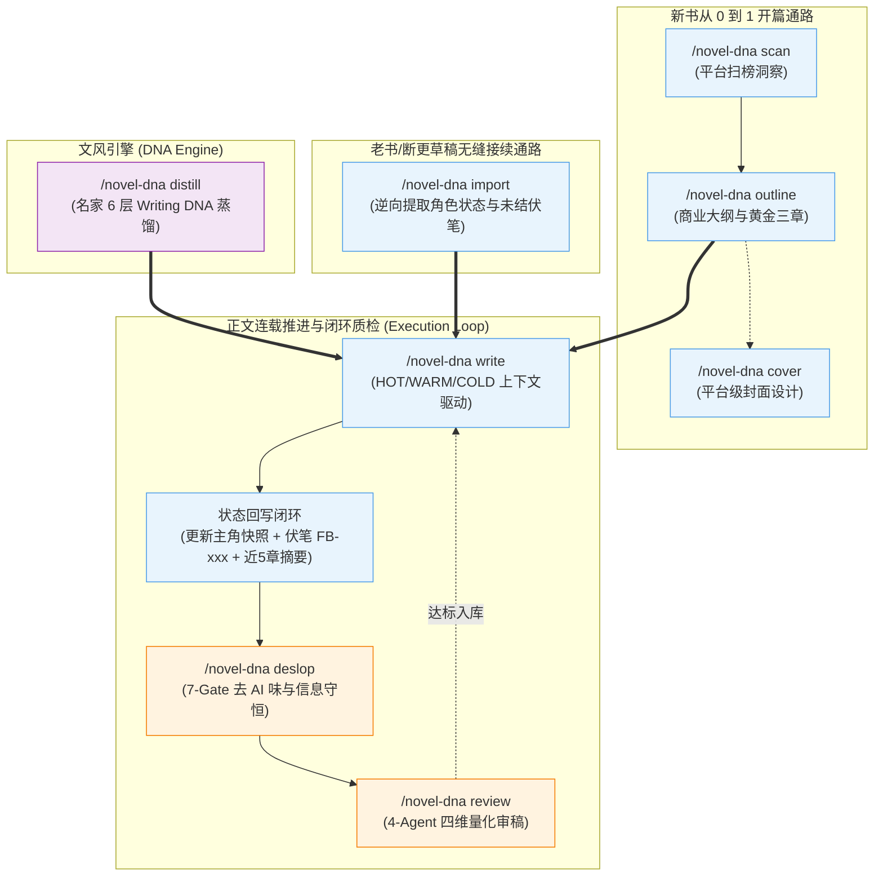

# 📖 novel-dna-craft：网文灵肉合一 AI 创作引擎

<div align="center">

[](https://github.com/DongHua3/novel-dna-craft)
[](LICENSE)
[](scripts/)
[](#)

**融合名家文风深度蒸馏（Writing DNA）与商业网文工业化架构（大纲/伏笔/正文/去AI/审稿/封面/老书接续）**

*让 AI 兼具商业爽点大纲的「肉身骨架」与大师级文学质感的「叙事灵魂」*

[核心特性](#-核心设计哲学与突破) • [指令矩阵](#-8-大指令矩阵与实战用法) • [工作流架构](#-标准工作流与双通路架构) • [去AI味体系](#-7-gate-网文去-ai-味与信息守恒) • [快速上手](#-全流程实战案例演示) • [致谢](#-致谢与开源协议)

</div>

---

## 💡 为什么做这个整合？（解决 AI 写小说的 4 大核心痛点）

市面上的 AI 写作工具通常走入两个极端：
1. **懂商业网文，但文笔极差**（如原版 `oh-story`）：虽然懂得开篇危机和黄金三章，但写出来的正文通篇是“眼中闪过一丝森然”、“心中一震”、“反击才刚刚开始”等**劣质 AI 套路腔**，千人一面；
2. **懂名家文风，但无法写连载**（如原版 `writing-dna`）：擅长提取单篇散文与公众号风格，但**完全缺乏长篇大纲、伏笔追踪与长程记忆机制**，写到第 5 章就人物失忆、境界崩坏。

**`novel-dna-craft` 彻底打破了这个僵局：**

| 行业常见痛点 | 传统 AI 写作的表现 | 🌟 `novel-dna-craft` 的工程解决方案 |
| :--- | :--- | :--- |
| **痛点 1：通识 AI 腔严重** | 句式机械工整、充斥排比与说教总结 | **6 层 Writing-DNA 深度蒸馏**：强制注入目标名家句长分布、逗号呼吸感与冷峻白描。 |
| **痛点 2：千人一腔/人设模糊** | 主角、反派、配角说话语气完全一样 | **专属角色声纹表 + 对白权力博弈法则**：掌控者话短冷静（≤10字），被动者话多慌乱（≥20字）。 |
| **痛点 3：长篇连载失忆/伏笔悬空** | 写到中后期道具凭空消失、战力体系崩坏 | **HOT/WARM/COLD 三层上下文 + `FB-xxx` 伏笔闭环**：写完强制回写状态快照与滚动微观摘要。 |
| **痛点 4：去 AI 味用力过猛** | 误把伏笔删除、篡改原意、误杀名家风格 | **DNA 拥有最高豁免权 + 语言学信息守恒**：严格限制删改比例（≤15%~35%），白名单精准过滤。 |

---

## 🏗️ 核心设计哲学与突破

```text
               ┌────────────────────────────────────────────────────────┐
               │          novel-dna-craft：网文灵肉合一创作引擎           │
               └───────────────────────────┬────────────────────────────┘
                                           │
         ┌─────────────────────────────────┴─────────────────────────────────┐
         ▼                                                                   ▼
┌─────────────────────────────────┐                         ┌─────────────────────────────────┐
│       【肉身 · 工业化骨架】       │                         │       【灵魂 · 名家文风】        │
│  • 起点/番茄/知乎黄金三章与分卷  │                         │  • L1 句长呼吸感与逗号密度指纹  │
│  • 场景 7 维功能化（拒绝无效注水）│                         │  • L2 危机/解构/反转篇章结构   │
│  • 伏笔三元组追踪矩阵 (FB-xxx)   │                         │  • L3-L5 认知模型与道德底线     │
│  • 4-Agent 多视角四维审稿矩阵   │                         │  • Show, Don't Tell 具象白描    │
└─────────────────────────────────┘                         └─────────────────────────────────┘
```

1. **灵肉合一**：大纲骨架负责剧情的极致拉扯、爽点兑现与倒计时危机；文风 DNA 负责字里行间的文学质感，彻底淘汰通识腔。
2. **场景功能化（Scene-Functional Writing）**：每一个正文小节必须实质改变**「风险、信息、关系、资源、抉择、行动、读者理解」**中的至少一项，无变化即判定为注水，坚决重写。
3. **DNA 豁免与信息守恒**：名家特有的语言指纹拥有最高豁免特权；去 AI 味时严禁无中生有增删事实，严格遵循 283 万字语言学实证法则。

---

## ⚡ 8 大指令矩阵与实战用法

Skill 提供统一调度中心，通过直觉命令驱动全流程创作：

| 指令 / 触发词 | 创作阶段 | 核心功能与输出产物 |
| :--- | :--- | :--- |
| **`/novel-dna`** | **主调度中心** | 模糊意图识别、小说工程状态自检、创作阶段流转 |
| **`/novel-dna distill`** | **文风深度蒸馏** | 从 20+ 名家章节中提取 L1~L5 规则，输出至 `文风DNA/` 目录 |
| **`/novel-dna scan`** | **市场洞察** | 扫描起点、番茄、知乎盐言、晋江当前风口题材、热门金手指与平台过签偏好 |
| **`/novel-dna outline`** | **商业大纲/开书** | 在 `设定集/` 中构思世界观、战力体系、角色档案（含声纹）、分卷大纲与黄金三章 |
| **`/novel-dna import`** | **老书逆向接续** | 导入已有 10~100+ 章断更旧稿，逆向还原人物状态快照与伏笔矩阵，无缝续写下一章 |
| **`/novel-dna cover`** | **平台封面设计** | 在 `封面/` 目录生成番茄 3:4 大头贴、起点 2:3 电影感、知乎极简海报等专业 AI 提示词与设计图 |
| **`/novel-dna write`** | **正文推进** | 融合文风 DNA + 权力博弈对白生成正文至 `正文章节/`，并在写完后**强制更新伏笔与状态** |
| **`/novel-dna deslop`** | **7-Gate 去AI味** | 执行 7 大门禁过滤 80+ 网文套路词、翻案腔与上帝剧透，严格遵守信息守恒 |
| **`/novel-dna review`** | **4视角量化审稿** | 读者留存员、战力一致性员、网文主编、文风质检员输出四维雷达评分（S/A/B 级） |

---

## 🔄 标准工作流与双通路架构



---

## 📁 初始化后的小说项目目录结构（全中文清晰易懂）

当使用 `/novel-dna outline` 开书或 `/novel-dna distill` 提取文风后，你的小说工程将拥有清晰、直观的**全中文目录架构**：

```text
我的小说项目/
├── 设定集/                               # 核心设定资产
│   ├── 00_作品总览与设定.md
│   ├── 01_世界观与战力体系.md
│   ├── 02_核心角色档案与声纹表.md        # 包含每个角色的专属对白声纹与口癖
│   ├── 03_分卷主线与黄金三章细纲.md      # 长篇黄金三章与分卷细纲
│   ├── 04_伏笔与状态追踪表.md            # 伏笔三元组矩阵与主角实时状态快照
│   └── 短篇_故事核与反转架构.md          # 知乎盐言等短篇三幕反转蓝图
├── 文风DNA/                              # 名家文风指纹资产
│   ├── Writing-DNA.md                    # 文风总入口 Master 指南
│   ├── 语言DNA.md                        # L1 句长分布、标点与白描习惯
│   ├── 文章结构模板.md                   # L2 篇章推进、高潮步长与断章模式
│   └── 写作视角与认知框架.md             # L3-L5 叙事视角、感官通道与价值观底线
├── 语料库/                               # 参考名家语料
│   ├── 原始章节/                         # 存放 20~30 篇参考名家章节 (.txt/.md)
│   └── 元数据/                           # 章节元数据 JSON 标注
├── 正文章节/                             # 正式生成的小说正文
│   ├── 第001章_降临与杀机.md
│   ├── 第002章_即时反打.md
│   └── ...
└── 封面/                                 # 封面设计产物
    ├── 封面提示词.txt                    # Midjourney / SD 英文专业提示词
    └── 封面_番茄版.png                   # 最终生成的平台封面
```

---

## 🧠 连载记忆：三层上下文与伏笔追踪闭环

为了彻底解决 AI 写长篇（50~100+ 章）容易发生的人物状态漂移、道具遗忘与伏笔悬空问题，正文推进采用严格的 **分层上下文协议**：

```text
┌─────────────────────────────────────────────────────────────┐
│ 1. HOT Context (当前章节卡点 - 实时强加载)                   │
│    • 当前章节事件细纲 (设定集/03_分卷主线与黄金三章细纲.md)   │
│    • 目标作者的 文风DNA/Writing-DNA.md / 语言DNA.md         │
└──────────────────────────────┬──────────────────────────────┘
                               │
┌──────────────────────────────▼──────────────────────────────┐
│ 2. WARM Context (最近状态与活跃线索 - 按需加载)              │
│    • 主角当前物理坐标、随身道具余额与身体伤势状态            │
│    • 当前活跃伏笔清单 (Open 状态的 FB-xxx 列表)              │
│    • 最近 3~5 章滚动微观摘要 (保持滑窗)                     │
└──────────────────────────────┬──────────────────────────────┘
                               │
┌──────────────────────────────▼──────────────────────────────┐
│ 3. COLD Context (全书背景设定集 - 索引式存档)               │
│    • 设定集/01_世界观与战力体系.md                           │
│    • 设定集/02_核心角色档案与声纹表.md                       │
└─────────────────────────────────────────────────────────────┘
```

### 伏笔三元组追踪矩阵（`设定集/04_伏笔与状态追踪表.md`）

| 伏笔 ID | 埋设章节 | 伏笔事件 / 物品描述 | 计划触发条件 / 关联线索 | 预期回收章节 | 当前状态 |
| :--- | :---: | :--- | :--- | :---: | :---: |
| `FB-001` | 第 1 章 | 主角胸口残缺古玉在杀敌时吸了一滴血，玉面浮现古朴符文 | 主角进入上古秘境，遭遇相同符文禁制 | 第 15~18 章 | **待触发 (Open)** |
| `FB-002` | 第 3 章 | 宗门藏经阁灰袍老仆暗中看了主角一眼，手腕带有黑色死斑 | 主角遭遇执法堂陷害时，老仆暗中出手相救 | 第 8 章 | **待触发 (Open)** |
| `FB-003` | 第 5 章 | 拍卖行拍下的一张残破羊皮地图 | 前往黑水沼泽历练时开启隐藏洞府 | 第 22 章 | **未激活 (Idle)** |

---

## 🛡️ 7-Gate 网文去 AI 味与信息守恒

结合 283 万字语言学实证研究与商业网文高频套路，构建了三层去 AI 味防护网：

```text
[Gate A: 禁用词库] ──> [Gate B: 句式套路] ──> [Gate C: 情绪动作化] ──> [Gate D: 节奏呼吸感]
       │
[Gate E: 对话去标签] ──> [Gate F: 结尾去升华] ──> [Gate G: 上帝视角消除]
```

1. **Gate A（禁用套路词）**：依据 [`references/banned-words.md`](references/banned-words.md) 80+ 词库，过滤“眼中闪过一丝”、“嘴角勾起一抹”、“深吸一口气”等套话。
2. **Gate B（句式套路）**：打散“不是A而是B”翻案腔与“，带着一丝嘲讽”万能状语。
3. **Gate C（情绪动作化）**：坚决贯彻 **Show, Don't Tell**，将“他感到很绝望”转化为冷汗、肌肉紧绷、后撤步等生理与物理白描。
4. **Gate D（节奏呼吸感）**：默认逗号长句推进叙事，紧张战斗切短句提速，拒绝机械对仗与电报体。
5. **Gate E（对话自然化）**：80% 对话无标签，依靠说话内容本身或动作引出。
6. **Gate F（结尾去说教）**：严禁章末全知升华与“反击才刚刚开始”，精准收束在具体物理动作或悬念处。
7. **Gate G（上帝视角消除）**：清除“他不知道的是…”、“命运的齿轮在这一刻悄然转动…”，视角严格锚定在场角色感知范围。

---

## 📂 Skill 仓库结构与规范库

```text
novel-dna-craft/
├── SKILL.md                          # 统一入口与 8 大模式调度中心
├── README.md                         # 架构说明与快速上手手册
├── LICENSE                           # MIT 开源许可证与致谢
├── .gitignore                        # 保护私有语料与草稿
├── references/                       # 10 大核心规范与权威知识库
│   ├── dna-distillation.md           # 6 层文风蒸馏方法论 (L1-L6) & 元数据 Schema
│   ├── commercial-outlining.md       # 商业网文大纲与黄金三章设计标准
│   ├── scene-functional-writing.md   # 场景功能化正文生成协议 (三层上下文架构)
│   ├── dialogue-and-emotional-arc.md # 对白权力博弈法则 (压制/反转/心死) 与六大情绪弧线
│   ├── legacy-book-import.md         # 老书与断更草稿逆向接续协议
│   ├── market-and-publishing.md      # 四大主流平台 (起点/番茄/知乎/晋江) 过签指南与受众偏好
│   ├── fiction-deslop-7gates.md      # 7-Gate 网文去AI味规范 (带DNA豁免权与信息守恒)
│   ├── banned-words.md               # 完整 AI 味禁用词与最毒句式清单 (80+ 词库)
│   ├── multi-agent-review.md         # 4-Agent 多视角审稿标准与四维评分矩阵
│   └── cover-design-prompt.md        # 平台级小说封面设计与 AI 提示词规范 (番茄/起点/知乎等)
├── templates/                        # 模版库
│   ├── 作者文风DNA/                  # 文风蒸馏模版 (语言DNA, Writing-DNA)
│   │   ├── 语言DNA.template.md
│   │   ├── 文章结构模板.template.md
│   │   ├── 写作视角与认知框架.template.md
│   │   └── Writing-DNA.template.md
│   └── 小说工程模版/                # 小说项目骨架模版
│       ├── 00_作品总览与设定.md
│       ├── 01_世界观与战力体系.md
│       ├── 02_核心角色档案与声纹表.md
│       ├── 03_分卷主线与黄金三章细纲.md
│       ├── 04_伏笔与状态追踪表.md
│       └── 短篇_故事核与反转架构.md
└── scripts/                          # 辅助分析 Python 脚本 (零依赖极速运行，跨平台兼容)
    ├── extract_style_stats.py        # 语料句长、标点、词频与对话比客观统计
    └── deslop_linter.py              # 7-Gate 网文套路词与违规句式快速质检
```

---

## 🛠️ 零依赖自动化本地脚本工具

内置 2 个纯 Python 脚本，**零第三方依赖，跨平台原生支持 Windows UTF-8**：

### 1. 语料文风客观指纹提取器 (`extract_style_stats.py`)
用于从目标名家 20+ 章节中秒级计算量化指标：
```bash
python ./scripts/extract_style_stats.py ./语料库/原始章节/
```
*输出示例*：
```text
=======================================================
       【novel-dna-craft】语料文风统计报告
=======================================================
- 语料总汉字数:   68,400 字
- 总段落数:       1,820 段 (平均每段 1.2 句)
- 平均单句字数:   19.24 字
- 短句(<=15字)比: 46.12% (节奏紧张度指标)
- 长句(>=45字)比: 4.85% (氛围铺垫指标)
- 对白占比:       36.40%
-------------------------------------------------------
【标点与呼吸感指纹 (每千字出现频次)】
- 逗号密度:       26.40 次/千字
- 破折号密度:     0.20 次/千字 (极度克制)
- 问号密度:       2.10 次/千字
=======================================================
```

### 2. 7-Gate 网文去 AI 味快速质检工具 (`deslop_linter.py`)
用于自动化扫描整本小说所有章节的套路词与违规句式，支持 `.deslop-whitelist` 白名单：
```bash
python ./scripts/deslop_linter.py ./正文章节/
```

---

## 🚀 全流程实战案例演示

以创作一本**都市高武+万倍返还系统**小说为例：

### 第 1 步：蒸馏你喜爱的名家文风
将目标名家的 20 篇章节放入 `语料库/原始章节/` 目录，输入：
```text
/novel-dna distill
```
> AI 自动运行分析脚本，在 `文风DNA/` 目录下生成 `Writing-DNA.md` 和 `语言DNA.md`（提炼出其短句战斗节奏、冷峻白描与特色标点习惯）。

### 第 2 步：市场扫榜与商业开书
```text
/novel-dna scan 起点 都市高武
/novel-dna outline 帮我开书：都市高武背景，主角觉醒万倍返还系统，开局遭遇退婚与武馆危机，快节奏打脸
```
> AI 自动在 `设定集/` 下生成全套设定集：世界观与战力体系、**包含专属口癖的角色声纹表**、黄金三章细纲与伏笔追踪矩阵。

### 第 3 步：设计契合平台的专属封面
```text
/novel-dna cover 目标平台番茄小说
```
> AI 自动根据番茄 3:4 比例在 `封面/` 目录输出人物大头贴、发光金色毛笔书名、作者名底部装饰框的专业 Midjourney 提示词。

### 第 4 步：注入 DNA 推进正文连载
```text
/novel-dna write 写第1章
```
> AI 强加载 HOT/WARM/COLD 上下文与文风 DNA，生成兼具大纲节奏与大师文笔的沉浸正文保存至 `正文章节/第001章.md`；**并在写完后自动在 `设定集/04表` 中登记新伏笔 `FB-001` 与主角状态快照**！

### 第 5 步：去 AI 味与四维终审
```text
/novel-dna deslop
/novel-dna review
```
> 严格遵循信息守恒与 DNA 豁免权，清除残留套路词；4 大审稿员给出量化雷达打分（S 级直接入库，A 级微调后入库）。

---

## 🤝 致谢与开源协议（License & Acknowledgements）

本项目基于 **MIT License** 开源。感谢以下开源项目奠定的开创性探索与坚实基础：

1. **[oh-story-claudecode](https://github.com/zenstory-ai/oh-story-claudecode)** (by @zenstory-ai) - 商业网文工业化大纲、黄金三章节奏、7-Gate 去AI味与多视角审稿矩阵。
2. **[writing-dna-skill](https://github.com/larashero3-dotcom/writing-dna-skill)** & **[lieflat-less-ai-tone](https://github.com/larashero3-dotcom/lieflat-less-ai-tone)** (by @larashero3) - 6 层文风深度蒸馏方法论、语言学信息守恒与去AI味实证研究。

---

<div align="center">
  <b>⭐ 如果这个项目对你的小说创作有所启发，欢迎在 GitHub 上点个 Star！⭐</b>
</div>
