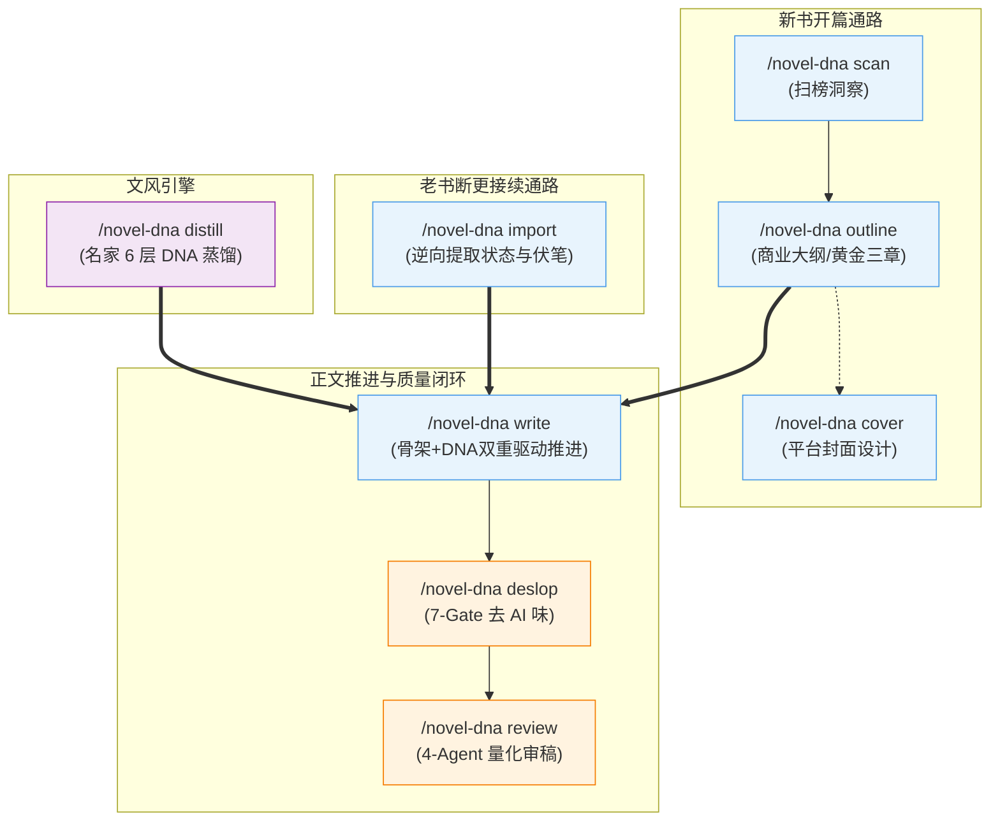

# novel-dna-craft：网文灵肉合一创作引擎

> **定位**：融合 `writing-dna-skill` 的**名家文风深度蒸馏**与 `oh-story-claudecode` 的**商业网文工业化架构**，打造既有商业爽点大纲节奏、又有名家文学质感的全流程小说创作 Skill。

---

## 核心设计哲学

1. **灵肉合一**：
   * **肉身（骨架）**：严密契合商业网文的开篇危机、金手指觉醒、期待感拉扯、爽点兑现与分卷细纲。
   * **灵魂（文风）**：严格加载名家 6 层 Writing DNA，由句长呼吸感、对白潜台词与冷峻白描驱动，拒绝通识 AI 腔。
2. **场景功能化（拒绝注水）**：
   * 每一节正文必须实质改变以下至少一项：`风险`、`信息`、`人物关系`、`资源`、`抉择`、`行动`、`读者理解`。
   * 欠字不机械加戏，超字不粗暴砍主线。
3. **DNA 豁免优先（保护作者个性）**：
   * 去 AI 味执行 7 大 Gate 门禁，但目标作者的 `Writing-DNA` 拥有**最高豁免权**，严禁将名家特有的标点与句法习惯当成 AI 味误杀。

---

## 指令总览与路由（Command Dispatcher）

| 指令 / 触发词 | 模式 | 核心功能 |
| :--- | :--- | :--- |
| `/novel-dna` | **主调度器** | 模糊意图识别、小说项目状态自检、创作阶段流转 |
| `/novel-dna distill` 或 `蒸馏文风` | **文风蒸馏** | 从 20+ 名家章节中提取 L1 语言、L2 结构、L3-L5 认知框架，输出 `Writing-DNA.md` |
| `/novel-dna scan` 或 `网文扫榜` | **市场洞察** | 扫描起点/番茄/知乎/晋江当前风口题材、热门金手指与过签偏好 |
| `/novel-dna outline` 或 `帮我开书` | **商业大纲** | 构思世界观、战力体系、角色档案、分卷大纲与黄金三章细纲（或短篇反转） |
| `/novel-dna import` 或 `老书接续` | **老书逆向** | 导入已有 10~100+ 章历史正文，逆向提取当前人物状态快照与伏笔矩阵，无缝续写 |
| `/novel-dna write` 或 `写第N章` | **DNA正文** | 强制读取 Writing DNA + 细纲，驱动多视角镜头与权力博弈对白生成高沉浸正文 |
| `/novel-dna deslop` 或 `去AI味` | **网文去AI** | 执行 7-Gate 门禁（清除套路词/僵硬对话/监控式流水账/上帝剧透，严格信息守恒） |
| `/novel-dna review` 或 `审稿` | **4视角审稿** | 读者爽感、设定一致性、毒点排查、文风契合度四维量化打分 |
| `/novel-dna cover` 或 `生成封面` | **封面设计** | 根据书名、题材与目标平台（番茄3:4/起点2:3/知乎等）生成专业级 AI 封面提示词与设计图 |

---

## 标准工作流与多通路架构（Execution Pipeline）

---

## 详细阶段执行规范

### 1. `/novel-dna distill`（文风蒸馏模式）
* **输入**：`corpus/raw/` 目录下的 20~30 篇目标作者小说章节（`.md` 或 `.txt`）。
* **执行步骤**：
  1. 为每篇语料创建 `_meta/` 元数据 JSON，用于分类标注；
  2. 运行 `scripts/extract_style_stats.py` 计算平均句长、短句比、长句比、逗号密度、对话占比；
  3. 深度提炼 6 层特征输出 `语言DNA.md`、`文章结构模板.md`、`写作视角与认知框架.md` 与总入口 `Writing-DNA.md`。
* **详细标准**：见 [references/dna-distillation.md](references/dna-distillation.md)。

---

### 2. `/novel-dna outline`（商业大纲与开书模式）
* **输入**：用户核心创意脑洞、目标题材（起点/番茄/知乎/晋江）、目标篇幅（长篇/短篇）。
* **执行步骤**：
  1. 确立题材核心金手指、主线主驱动力与终极冲突；
  2. **长篇**：搭建黄金三章细纲 + 分卷大纲；**短篇**：搭建三幕反转架构；
  3. 输出项目核心设定集：`00_作品总览与设定.md`、`01_世界观与战力体系.md`、`02_核心角色档案与声纹表.md`、`03_分卷主线与黄金三章细纲.md`（或 `短篇_故事核与反转架构.md`）、`04_伏笔与状态追踪表.md`。
* **详细标准**：见 [references/commercial-outlining.md](references/commercial-outlining.md) 与 [references/market-and-publishing.md](references/market-and-publishing.md)。

---

### 3. `/novel-dna import`（老书与断更草稿逆向接续模式）
* **输入**：用户已有的小说历史正文（10~100+ 章 `.txt` 或 `.md`）。
* **执行步骤**：
  1. 以最后完整章节为截面，逆向提取主角与核心角色的身心状态、境界、物理坐标、随身道具余额与人际关系；
  2. 梳理前文未结悬念与伏笔，自动初始化生成 `02_核心角色档案与声纹表.md` 与 `04_伏笔与状态追踪表.md`；
  3. 确立下一章推进细纲，直接无缝衔接进入 `/novel-dna write` 续写！
* **详细标准**：见 [references/legacy-book-import.md](references/legacy-book-import.md)。

---

### 4. `/novel-dna write`（DNA 注入正文推进模式）
* **前置读取协议（强制，缺一不可）**：
  1. 通读当前项目的 `Writing-DNA.md` 与 `语言DNA.md`；
  2. 从 `corpus/raw/` 抽读 3~5 篇原文校准句式呼吸感；
  3. 读取章节细纲卡点任务、`04_伏笔表` 的状态快照与近 3 章滚动摘要；
  4. 读取 `02_核心角色档案与声纹表.md` 中出场角色的对白声纹。
* **正文输出铁律**：
  * **场景功能化**：每节必须改变风险/信息/关系/资源/抉择/行动/读者理解中至少一项；
  * **对白权力博弈与潜台词**：掌控者话短（≤10字），被压制方话长；对白暗藏私密议程，杜绝科普嘴；
  * **情绪弧线匹配**：根据章节定位严密执行 V形、倒V、W形、递进、延迟满足或急转弧线；
  * **结尾钩子**：章末留下悬念、危机或利益预期。
* **正文生成后强制执行（不可跳过）**：
  1. **刷新主角状态快照**（境界、坐标、道具消耗、伤势）；
  2. **伏笔登记/回收**（埋新伏笔登 `FB-xxx`，回收改 `Closed`）；
  3. **追加滚动摘要**（≤50 字，保持最近 5 章滑窗）。
* **详细标准**：见 [references/scene-functional-writing.md](references/scene-functional-writing.md) 与 [references/dialogue-and-emotional-arc.md](references/dialogue-and-emotional-arc.md)。

---

### 5. `/novel-dna deslop`（7-Gate 网文去 AI 味模式）
* **最高铁律**：**信息守恒**（不增删事实与因果）、**DNA 豁免权**（名家指纹优先）、**过度去味保护**（删改比依轻/中/重度设 15%/25%/35% 上限）。
* **7 大门禁自检**：Gate A（禁用词库）、Gate B（翻案腔/万能状语）、Gate C（情绪动作化）、Gate D（节奏呼吸感）、Gate E（对话自然化）、Gate F（结尾去说教）、Gate G（上帝视角消除）。
* **详细标准**：见 [references/fiction-deslop-7gates.md](references/fiction-deslop-7gates.md) 与 [references/banned-words.md](references/banned-words.md)。

---

### 6. `/novel-dna review`（4-Agent 多视角审稿模式）
* **评审矩阵**：读者留存员（爽感与节奏）、战力一致性员（设定与伏笔）、网文主编（商业价值与毒点）、文风质检员（DNA 契合与去AI）。
* **输出**：四维量化打分（S/A/B 级评级）、定位清单与修改建议。
* **详细标准**：见 [references/multi-agent-review.md](references/multi-agent-review.md)。

---

### 7. `/novel-dna cover`（平台级封面设计与提示词生成）
* **输入**：书名、作者笔名、题材类型、核心主角外貌特征、目标平台。
* **输出**：生成符合番茄 3:4 大头贴、起点 2:3 电影感、知乎极简海报等平台调性的专业 AI 提示词与设计图。
* **详细标准**：见 [references/cover-design-prompt.md](references/cover-design-prompt.md)。
